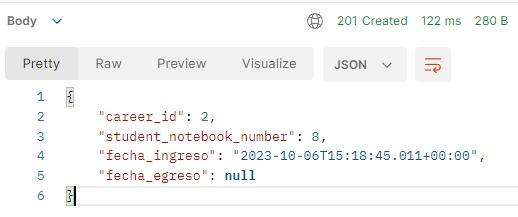
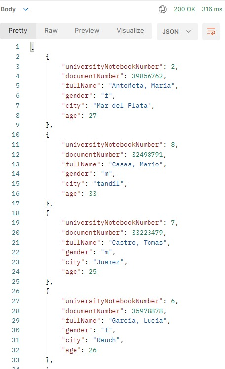

[](https://www.postman.com/)
# Trabajo Entregable 3

 ## 3) Testear la invocación a los servicios REST mediante Postman, o cliente similar.
   - **2a-** [Dar de alta un Estudiante](#dar-de-alta-un-estudiante)
   - **2b-** [Matricular un estudiante en una carrera](#matricular-un-estudiante-en-una-carrera)
   - **2c-** [Recuperar todos los estudiantes, y especificar algún criterio de ordenamiento simple](#recuperar-todos-los-estudiantes-ordenados-por-apellido)
   - **2d-** [Recuperar un estudiante, en base a su número de libreta universitaria.](#recuperar-un-estudiante-por-numero-de-libreta-universitaria)
   - **2e-** [Recuperar estudiantes en base a su genero](#recuperar-estudiantes-por-genero)
   - **2f-** [Recuperar las carreras con estudiantes inscriptos, y ordenar por cantidad de inscriptos](#recuperar-carreras-con-estudiantes-inscriptos)
   - **2g-** [Recuperar los estudiantes de una determinada carrera, filtrado por ciudad de residencia.](#recuperar-estudiantes-de-una-carrera-por-ciudad-de-residencia)
   - **2h-** [Generar un reporte de las carreras, que para cada carrera incluya información de los inscriptos y egresados por año. Se deben ordenar las carreras alfabéticamente, y presentar los años de manera cronológica.](#generar-un-reporte-de-carreras)
  
  A continuacion mostraremos la resolucion del punto 3, teniendo en cuenta los incisos de la pregunta 2 utilizando Postman para los servicios REST.
  
--------------------------------------------------------------------------------------------------------------------
### Dar de alta un estudiante
Para dar de alta un estudiante en el sistema, realizamos una solicitud POST a la URL ```  http://localhost:8080/students ```

 En el cuerpo de la solicitud, proporcionamos los detalles del estudiante, como DNI, nombre, apellido, nacimiento, genero y . Luego, analizamos la respuesta para confirmar que el estudiante se ha registrado correctamente.
```
{   
    "documentNumber":32498791,
    "name": "Mario",
    "surname":  "Casas",
    "birthdate":"1990-10-06T15:18:45.011+00:00",
    "gender":"m",
    "city": "tandil"
}
```  
Y obtendremos como resultado:

<div>

</div>

Con la insercion del estudiante en la tabla students:

<div>

</div>

--------------------------------------------------------------------------------------------------------------------
### Matricular un estudiante en una carrera
Para matricular un estudiante en una carrera, utilizamos una solicitud POST a la URL ```http://localhost:8080/inscriptions```

En el cuerpo de la solicitud, especificamos el ID de la carrera en la que deseamos matricularlo, el numero de libreta universitaria (id del alumno) y la fecha de ingreso. 
```
{   
  "career_id":2,
  "student_notebook_number":8,
  "fecha_ingreso": "2023-10-06T15:18:45.011+00:00"
}
```  
Verificamos la respuesta para asegurarnos de que la matriculación se haya realizado con éxito, y obtendremos como resultado:

<div>

</div>

Con la insercion del estudiante en la tabla students:

<div>

</div>

--------------------------------------------------------------------------------------------------------------------
### Recuperar todos los estudiantes ordenados por apellido
Para recuperar todos los estudiantes registrados en el sistema, realizamos una solicitud GET a la URL ```http://localhost:8080/students/sortBySurname```

<div>

</div>

Si enviamos esa solicitud, nos devolvera la lista de estudiantes, ordenadas por su apellido:

<div>

</div>

--------------------------------------------------------------------------------------------------------------------
### Recuperar un estudiante por numero de libreta universitaria

Para recuperar un estudiante específico en base a su número de libreta universitaria, utilizamos una solicitud GET a la URL ```http://localhost:8080/students/{universityNotebookNumber}```, donde `{universityNotebookNumber}` es el número de libreta universitaria del estudiante, el cual vendria a ser su ID.

En este caso traeremos el estudiante con universityNotebookNumber = 8, el que previamente fue añadido.

GET ```http://localhost:8080/students/8```

<div>

</div>

Analizamos la respuesta para verificar que se haya recuperado el estudiante correcto.

<div>

</div>

--------------------------------------------------------------------------------------------------------------------
### Recuperar estudiantes por genero
Para recuperar estudiantes en base a su género, realizamos una solicitud GET a la URL ```http://localhost:8080/students/gender/{gender}``` donde `{gender}` es el género deseado.

En este caso vamos a filtrar for genero 'f' (femenino)

GET ```http://localhost:8080/students/gender/f```

<div>

</div>

Y obtendremos como resultado:

<div>

</div>

Podemos observar que la respuesta obtenida de la Query, coincide con la base de datos

<div>

</div>

--------------------------------------------------------------------------------------------------------------------
### Recuperar carreras con estudiantes inscriptos

Para recuperar las carreras con estudiantes inscriptos, efectuamos una solicitud GET a la URL ```http://localhost:8080/careers/sortByCantInsc```

<div>

</div>

Obtendremos como resultado:

<div>

</div>

--------------------------------------------------------------------------------------------------------------------
### Recuperar estudiantes de una carrera por ciudad de residencia
Para recuperar los estudiantes de una carrera específica filtrados por ciudad de residencia, utilizamos una solicitud GET a la URL ```http://localhost:8080/students/findByCareerAndCity/{careerId}/{city}```, donde `{careerId}` es el ID de la carrera y `{city}` es la ciudad deseada.

```http://localhost:8080/students/findByCareerAndCity/2/tandil```

<div>

</div>

En este caso, vamos a obtener una lista de estudiantes, que estudien la carrera Tudai(careerId=2) y que sean de la ciudad de Tandil (city).

Examinamos la respuesta para obtener la lista de estudiantes que cumplen con ambos criterios:

<div>

</div>

Podemos observar que el JSON nos devuelve al estudiante que ingresamos en el punto 2a, y luego inscribimos en el 2b.

--------------------------------------------------------------------------------------------------------------------
### Generar un reporte de carreras
Finalmente, para generar un reporte de carreras que incluya información sobre los inscritos y egresados por año, realizamos una solicitud GET a la URL `http://localhost:8080/inscriptions/report`. Analizamos la respuesta para obtener el informe deseado, que está ordenado alfabéticamente y presenta los años de manera cronológica.

GET ```http://localhost:8080/inscriptions/report```

<div>

</div>

Al ejecuitarlo, obtendremos como resultado:

<div>

</div>

El JSON nos devolvera los resultados, ordenados por carrera y año, junto con la cantidad de inscriptos y egresados que tiene ese año.

--------------------------------------------------------------------------------------------------------------------

